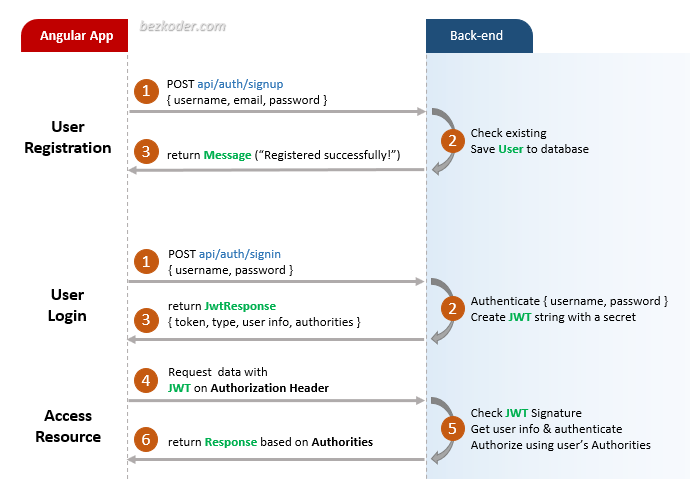

# Angular 11 JWT Authentication example

## Flow for User Registration and User Login
For JWT – Token based Authentication with Web API, we’re gonna call 2 endpoints:
- POST `api/auth/signup` for User Registration
- POST `api/auth/signin` for User Login

You can take a look at following flow to have an overview of Requests and Responses that Angular 10 Client will make or receive.

## Angular JWT App Diagram with Router and HttpInterceptor

For more detail, please visit:
> [Angular 11 JWT Authentication & Authorization with Web API](https://bezkoder.com/angular-11-jwt-auth/)

## With Spring Boot back-end

> [Angular + Spring Boot: JWT Authentication & Authorization example](https://bezkoder.com/angular-11-spring-boot-jwt-auth/)

Run `ng serve` for a dev server. Navigate to `http://localhost:4200/`.
